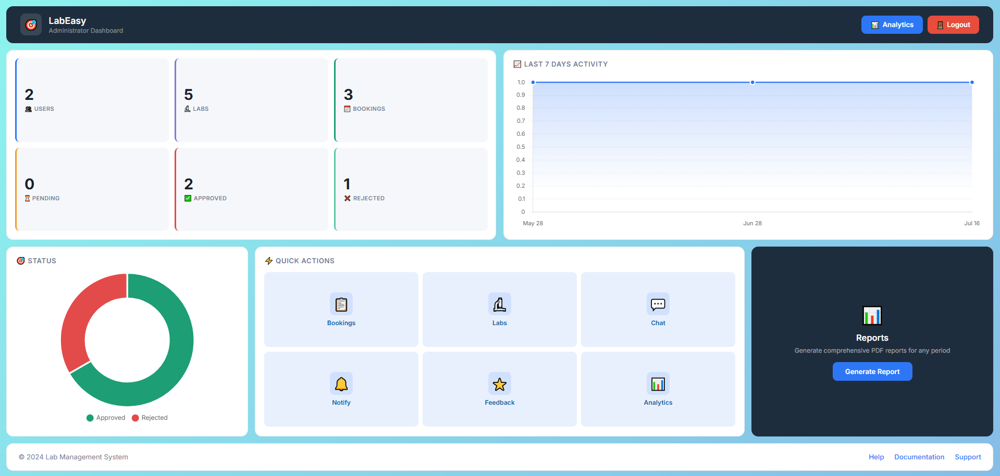
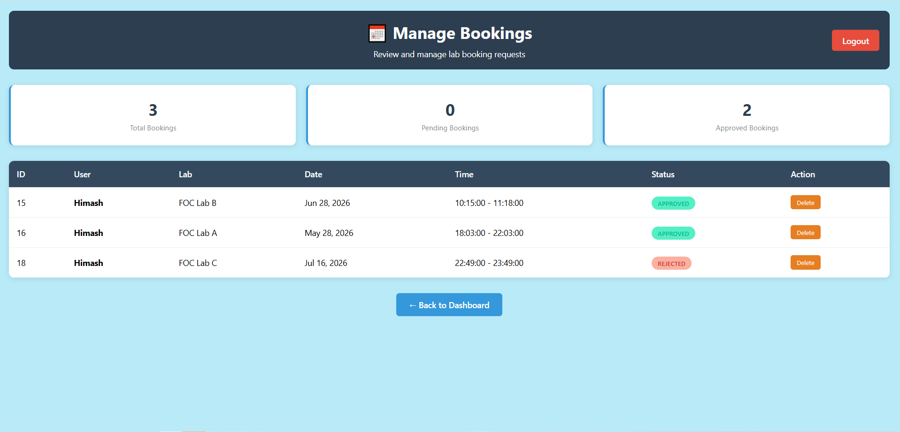
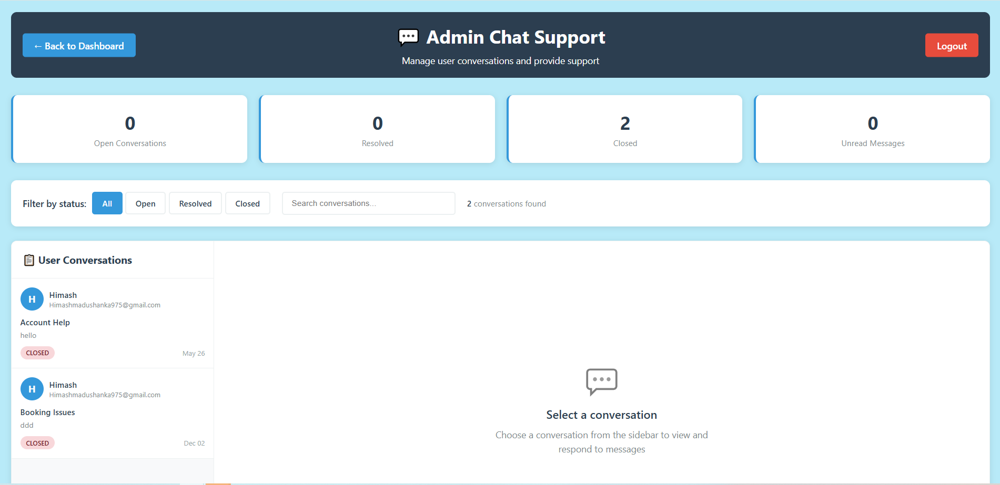
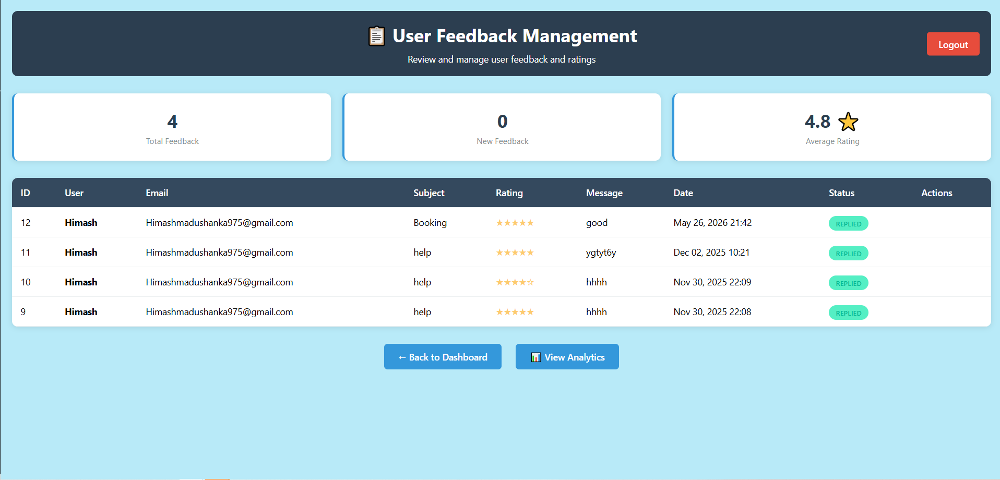
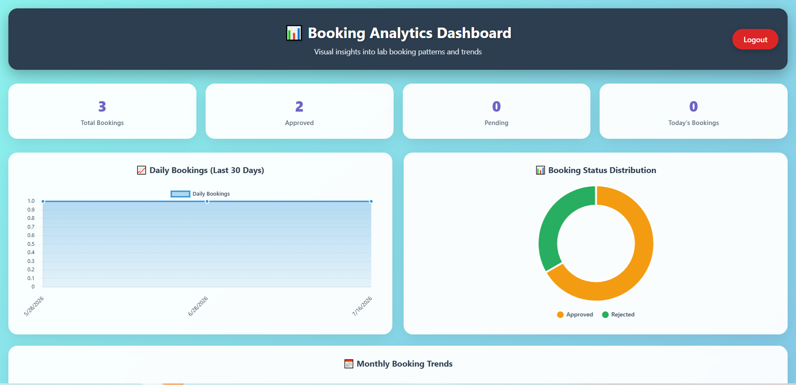
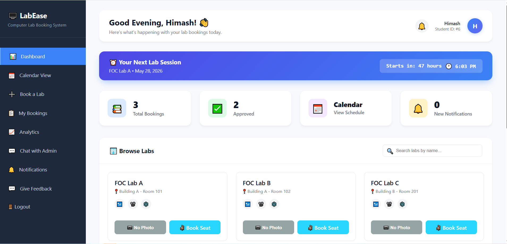
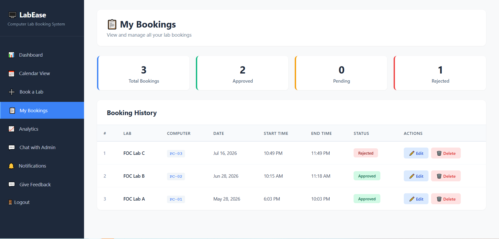
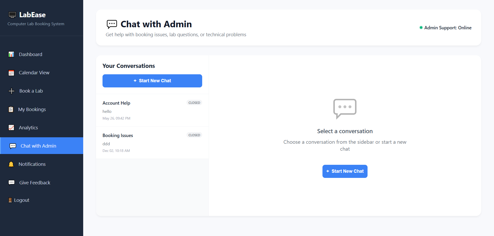
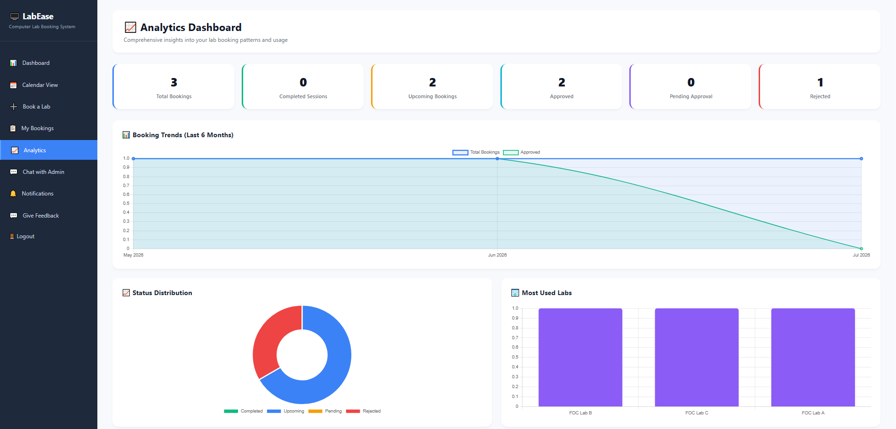
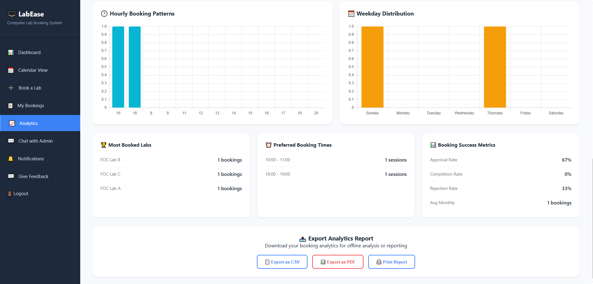

# 🖥️ LabEase – Computer Lab Booking Management System

LabEase is a modern web-based Computer Lab Booking System developed using PHP, MySQL, HTML, CSS, and JavaScript.  
It helps students reserve computer labs easily while enabling administrators to manage bookings, notifications, analytics, reports, and lab resources efficiently.

---

# ✨ Features

## 👨‍🎓 Student Features
- User Registration & Login
- Book Computer Labs
- View Upcoming Sessions
- Booking Status Tracking
- Interactive Dashboard
- Real-Time Notifications
- Calendar View
- Chat with Admin
- Feedback Submission
- Download Lab Photos
- Search & Filter Labs

## 👨‍💼 Admin Features
- Admin Dashboard
- Booking Management
- Approve / Reject Reservations
- Lab Management
- Analytics & Charts
- Notification Management
- Feedback Monitoring
- PDF Report Generation
- User Management

---

# 📸 System Screenshots

## Admin Dashboard
- 
- 
- 
- 
- 

## User Dashboard
- 
- 
- 
- 
- 

---

# 🛠️ Technologies Used

| Technology | Purpose |
|------------|----------|
| PHP | Backend Development |
| MySQL | Database Management |
| HTML5 | Structure |
| CSS3 | Styling |
| JavaScript | Interactive Features |
| Chart.js | Analytics Charts |
| XAMPP | Local Server Environment |

---

# 📊 Dashboard Features

## 👨‍💼 Admin Dashboard
The admin dashboard provides complete management and monitoring capabilities for the system.

### Features
-  Total Users Counter
-  Total Labs Overview
-  Booking Statistics
-  Daily Booking Charts
-  Status Distribution Analytics
-  Quick Management Tools

---

## 👨‍🎓 User Dashboard
The user dashboard allows students to manage bookings efficiently.

### Features
-  Total Bookings Overview
-  Approved Sessions Counter
-  Notification Center
-  Next Session Countdown
-  Lab Search System

---

# 🔔 Notification System

The notification module provides real-time communication between admins and users.

### Features
-  Real-time Notifications
-  Mark as Read Functionality
-  Notification Badge Counter
-  Admin Broadcast Notifications

---

# 📅 Booking System

## 👨‍🎓 Student Features
Students can:
-  Select Available Labs
-  Choose Booking Date & Time
-  View Approval Status
-  Track Upcoming Sessions

## 👨‍💼 Admin Features
Administrators can:
-  Approve Bookings
-  Reject Bookings
-  Monitor Booking History

---

# 📈 Analytics

The system integrates Chart.js for advanced data visualization.

### Analytics Features
-  Daily Booking Activity
-  Booking Status Distribution
-  Interactive Dashboard Charts

---

# 🔐 Security Features

The project includes multiple security mechanisms to ensure system safety.

### Security Implementations
-  Session Authentication
-  Admin Authorization
-  SQL Injection Prevention using Prepared Statements
-  Secure Form Handling
-  Input Validation

---

# 🌟 Support the Project

If you like this project, please give it a ⭐ on GitHub.

It helps:
-  Support open-source learning
-  Share with other developers

---

# 👨‍💻 Developed By

**K. Himash Madushanka**  
🎓 Data Science Undergraduate

